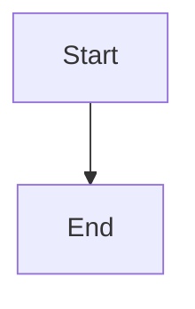

# console-mermaid

Render Mermaid diagrams as ASCII/Unicode in the terminal.

This is a Rust port of the original Go project and focuses on producing readable, deterministic console output for flowcharts and sequence diagrams.

## Features

- Renders Mermaid flowcharts and sequence diagrams to text
- Supports Unicode box drawing or ASCII-only output
- Adjustable box and node spacing
- Reads from a file or stdin

## Install

Build locally:

```bash
cargo build --release
```

Run directly:

```bash
cargo run -- --help
```

Install globally with Cargo:

```bash
cargo install --git https://github.com/AlextheYounga/console-mermaid.git
```

Make sure Cargo's bin directory is on your `PATH` (usually `~/.cargo/bin`).

## Usage

```bash
# From a file
cargo run -- path/to/diagram.mmd

# From stdin
cat path/to/diagram.mmd | cargo run -- -
```

### Common options

- `--ascii` use ASCII-only characters
- `--coords` show layout coordinates (debug)
- `--box-padding <n>` box padding inside nodes
- `--padding-x <n>` horizontal spacing between nodes
- `--padding-y <n>` vertical spacing between nodes
- `--graph-direction <LR|TD>` override graph direction

## Example



```bash
cargo run -- --ascii - <<'EOF'
flowchart TD
A["Start"] --> B["End"]
EOF
```

## Credits

This project is a Rust port of the original Go implementation by AlexanderGrooff:
https://github.com/AlexanderGrooff/mermaid-ascii
